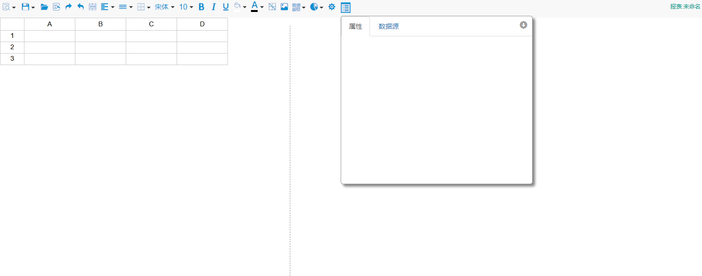
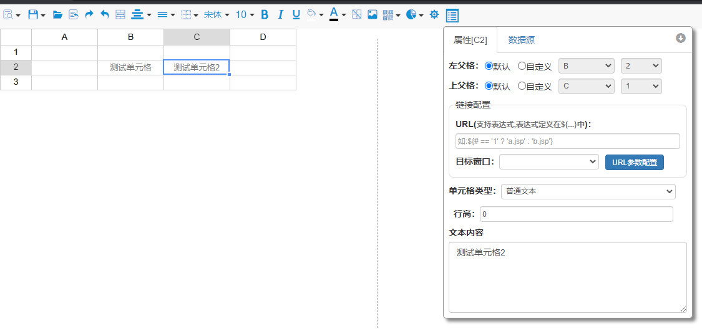
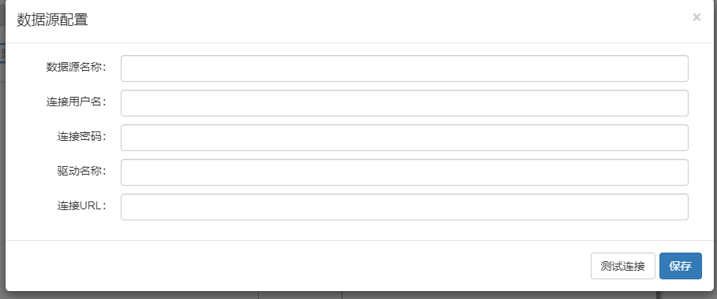
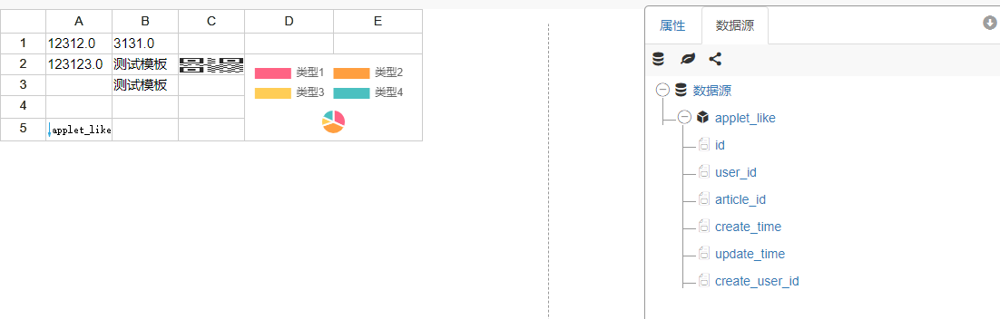
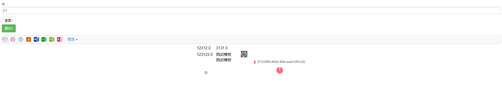

# 简介

UReport-kepp是UReport的替代项目，因为发现UReport项目作者不再维护。觉得这么好的项目不维护就有点可惜，所以就尝试着维护该项目！

UReport2是一款高性能的架构在Spring之上纯Java报表引擎，通过迭代单元格可以实现任意复杂的中国式报表。  
在UReport2中，提供了全新的基于网页的报表设计器，可以在Chrome、Firefox、Edge等各种主流浏览器运行（IE浏览器除外）,打开浏览器即可完成各种复杂报表的设计制作。

### 目前已将ureport2改为Spring-boot架构，开发、配置、部署更简单，也修复了少量已存bug！
### 正在计划中：将更换高大上的前端设计界面，使界面交互更友好。

#### 如果有发现的bug可提Issues

## 文档视频教程地址：
1.  BSDN WIKI： [http://wiki.bsdn.org/display/UR/ureport2+Home](http://wiki.bsdn.org/display/UR/ureport2+Home)
2.  w3cschool： [https://www.w3cschool.cn/ureport](https://www.w3cschool.cn/ureport)

# 演示地址
地址：
[http://report.tt-u.cn/ureport_keep/designer/designer](http://report.tt-u.cn/ureport_keep/designer/designer)

# 运行步骤
1、拉取代码
```
git clone https://gitee.com/summer-T/ureport-keep.git
```

2、运行spring boot ``` UreportKeepApplication ``` main方法

3、启动服务后访问地址：``` http://localhost:8888/ureport_keep/designer/designer ```


# 界面






# 交流
| 微信扫码添加交流 |
|--------|
||
