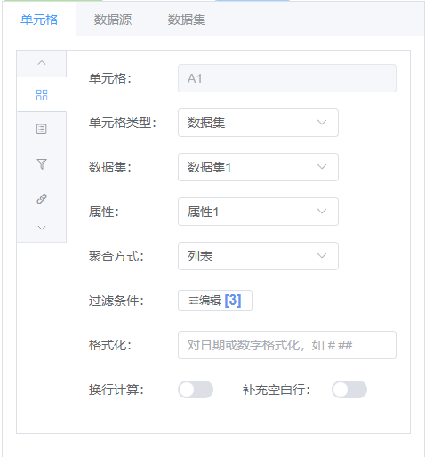
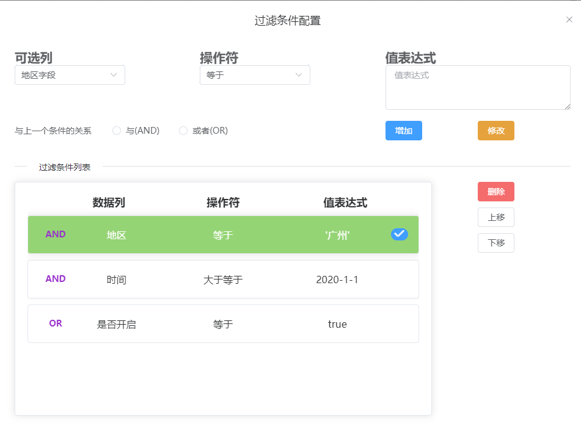
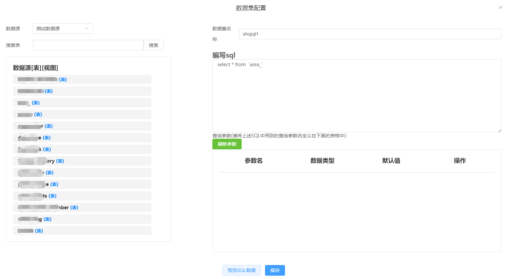

# 简介

UReport-kepp是UReport的替代项目，因为发现UReport项目作者不再维护。觉得这么好的项目不维护就有点可惜，所以就尝试着维护该项目！

### 目前已将ureport2改为Spring-boot架构，开发、配置、部署更简单！后期将更换前端界面，让界面交互更友好。

UReport2是一款高性能的架构在Spring之上纯Java报表引擎，通过迭代单元格可以实现任意复杂的中国式报表。  
在UReport2中，提供了全新的基于网页的报表设计器，可以在Chrome、Firefox、Edge等各种主流浏览器运行（IE浏览器除外）,打开浏览器即可完成各种复杂报表的设计制作。

## 新版报表项目：[keepReport](https://gitee.com/march-x/keepReport)

## 文档视频教程地址：
1.  BSDN WIKI： [http://wiki.bsdn.org/display/UR/ureport2+Home](http://wiki.bsdn.org/display/UR/ureport2+Home)
2.  w3cschool： [https://www.w3cschool.cn/ureport](https://www.w3cschool.cn/ureport)

## 新增函数说明地址
Gitee Wiki: [https://gitee.com/summer-T/ureport-keep/wikis/pages](https://gitee.com/summer-T/ureport-keep/wikis/pages)

# 界面


# 运行步骤

## spring boot项目运行
1、拉取代码
```
git clone https://gitee.com/summer-T/ureport-keep.git
```

2、运行spring boot ``` UreportKeepApplication ``` main方法

3、启动服务后访问地址：``` http://localhost:8888/ureport_keep/designer/designer ```
## 前端项目构建
前端项目路径``` ureport-keep-js ```

1、安装npm
```
npm install
```

2、编译js
```
npm run build
```

# 交流
| 微信扫码添加交流 | 请开发者喝一杯奶茶吧 |
|--------|-------- |
|||

# 新版报表界面
## 进入查看：[keepReport](https://gitee.com/march-x/keepReport)
| 预览 | 
|--------|
|
|
| |

